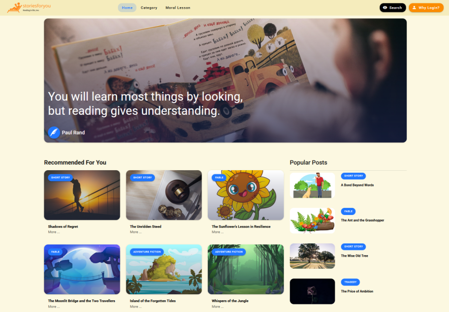

# storiesforyou

When you read an online story, you're not just reading it on your own. You're joining a community of readers and authors who are passionate about stories. You can share your thoughts on the story with other readers, and you can even leave comments for the story.

## Preview

**[View Live Preview](https://storiesforyou.net/)**

## Usage

### Basic Usage

Clone the source files of the theme and navigate into the theme's root directory. Run `yarn` and then run `yarn dev`
which will open up a preview of the template in your default browser, watch for changes to core template files, and live
reload the browser when changes are saved. You can view the `package.json` file to see which scripts are included.

#### Scripts
We have now switched to the Vite build tool, which is much faster.

- `yarn dev` start a vite dev server
- `yarn build` build all file to `dist`

## Bug & Issues

Have a bug or an issue with this template? [Open a new issue](https://github.com/AGDholo/giraffe/issues).

## About

Giraffe is an open source library of free Vuetify themes and templates。All of the free themes and templates on HeroUI
are released under the MIT license, which means you can use them for any purpose, even for commercial projects.

- <https://heroui.net/>
- <https://github.com/AGDholo>

Giraffe based on the [Vuetify](https://vuetifyjs.com/) framework created
by [stackFlam1ngo](https://twitter.com/stackFlam1ngo).

## Copyright and License

Copyright 2022 HeroUI LLC. Code released under the [MIT](https://github.com/AGDholo/giraffe/blob/master/LICENSE)
license.

## Sponsor

I accept all sponsorship, if you want to cooperate, please feel free to contact me.

"# stories-ui" 
